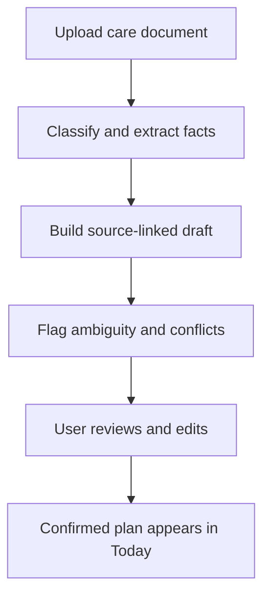
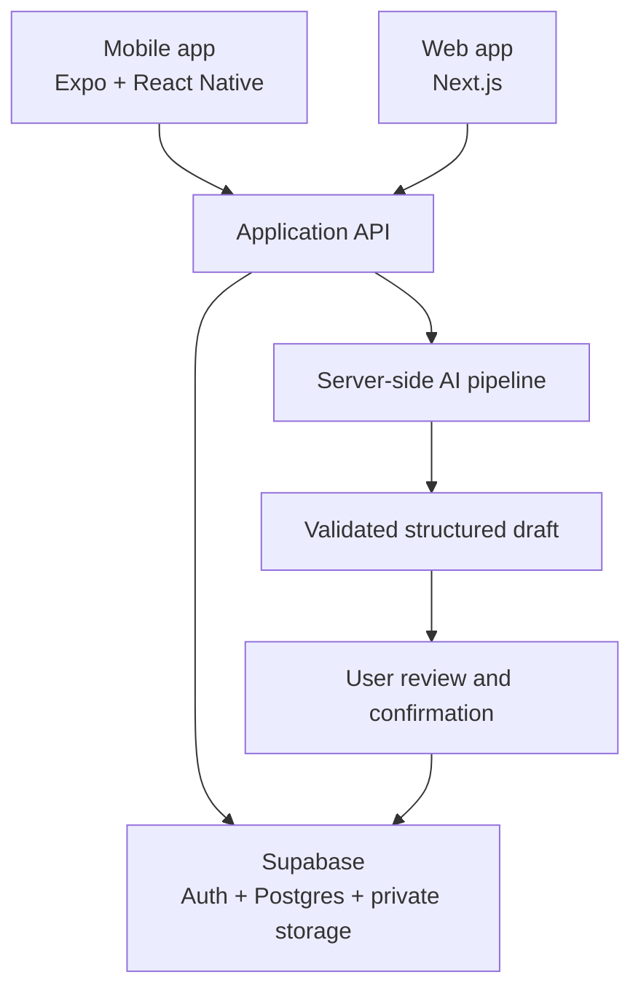
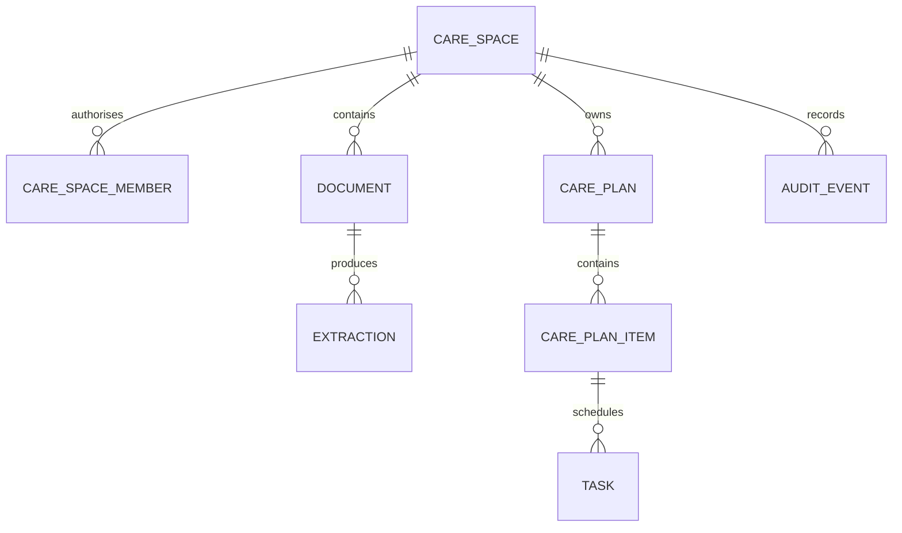

# studious-invention
CareCompass AI is a phone-first care coordination platform that turns discharge notes, therapy plans, medications, appointments, symptoms and wearable data into clear daily actions. It helps families organise recovery, coordinate caregiving, prepare for clinical visits and recognise when professional advice may be needed.
# CareCompass AI

> Turning fragmented recovery and caregiving information into clear, traceable daily action.

**Repository:** `studious-invention`  
**Status:** Product definition / pre-alpha  
**Initial market:** Patient and family care coordination after hospital discharge  
**Primary experience:** iOS and Android, supported by a responsive web companion

CareCompass AI is a phone-first care coordination platform for patients, families and caregivers managing recovery, rehabilitation and ageing-related care. It converts discharge notes, therapy plans, appointment letters and other care documents into a structured draft plan that people can review, correct and use day to day.

CareCompass is designed to **organise, explain, remind, coordinate and escalate**. It is not intended to diagnose disease, prescribe treatment, replace clinical judgement or provide emergency services.

> [!IMPORTANT]
> CareCompass is at an early development stage and is not a medical device, clinical service or production-ready health application. Do not upload real patient information until the required privacy, security, consent and governance controls have been implemented and independently reviewed.

## Why CareCompass exists

Recovery rarely fails because no instructions were given. More often, useful instructions are scattered across documents, appointments, conversations, medication lists and different members of a family. The burden of turning all of that information into coordinated action falls on the patient or an informal caregiver—often at the moment when they have the least time and capacity to do it.

The problem is becoming more important as populations age, families assume more care responsibilities and rehabilitation needs remain underserved. The World Health Organization reports that rehabilitation need is substantially unmet in many settings and calls for person-centred, coordinated care across health and social-care providers.

CareCompass addresses the execution gap between **receiving care information** and **acting on it safely at home**.

## Product promise

> Upload a discharge, rehabilitation or care document and receive a clear, editable and source-linked action plan for the next 14 days.

Every important AI-generated item should answer three questions:

1. **What was extracted?**
2. **Where did it come from?**
3. **Does it need confirmation?**

## What CareCompass does

Users can eventually add or forward:

- hospital discharge documents;
- physiotherapy and occupational-therapy instructions;
- home exercise plans;
- medication lists;
- appointment and referral letters;
- caregiver notes;
- symptom and recovery check-ins;
- selected wearable summaries; and
- relevant insurance or billing documents.

CareCompass transforms these inputs into:

- a plain-language summary;
- an editable daily recovery plan;
- dated tasks and reminders;
- follow-up appointments;
- questions for a clinician or therapist;
- clearly labelled uncertainties;
- source-linked red-flag guidance taken from the supplied material;
- caregiver responsibilities and shared updates; and
- concise progress summaries for appointments.

## What CareCompass does not do

CareCompass does not:

- diagnose a condition;
- prescribe, recommend or change treatment;
- alter medication names, doses, frequencies or instructions;
- infer that a task is safe merely because a model generated it;
- replace a clinician, therapist, pharmacist or emergency service;
- autonomously triage emergencies;
- activate AI-generated actions before user confirmation; or
- present model confidence as clinical certainty.

If the intended use later expands into diagnosis, treatment adaptation, patient-specific clinical recommendations or other medical purposes, that capability must enter a separate regulatory, clinical-validation and quality-management workstream before release.

## V1: the Care Plan Compiler

The first version will focus on one complete workflow:



### V1 scope

1. Register and create a private Care Space.
2. Photograph or upload a PDF or image.
3. Extract facts into a validated schema.
4. Generate a plain-language summary and draft actions.
5. Link every material action to its source location.
6. Flag missing, ambiguous or conflicting information.
7. Let the user confirm, edit, remove or mark each item for clarification.
8. Place only confirmed items on the Today screen.
9. Export a printable summary for family or clinician discussion.

### Explicitly outside V1

- diagnosis or treatment recommendations;
- medication changes;
- autonomous clinical escalation;
- wearable integrations;
- clinician decision support;
- insurance claims processing;
- voice agents; and
- autonomous background agents.

## Designed around roles, not devices

| User | Primary surface | Core question |
| --- | --- | --- |
| Patient | Phone / accessible tablet | What do I need to know or do today? |
| Family caregiver | Phone / web | What needs attention, and who is responsible? |
| Clinician or care coordinator *(future)* | Web | What changed, what is the source and what needs review? |

The same event may be presented differently to each authorised role while preserving one underlying record and audit trail.

## Product surfaces

### Mobile: daily companion

The mobile application is the primary experience for document capture, daily actions, reminders, check-ins and family updates.

Planned top-level navigation:

```text
Today | Care Plan | Ask | Records | Family
```

The home screen should be proactive and answer **“What needs attention today?”** rather than begin with an empty chat box.

### Web: memory and command centre

The responsive web application is intended for multi-document upload, timeline review, plan editing, permissions, appointment preparation and report export.

### Tablet: accessible home mode

Tablet layouts will use the same mobile codebase with larger type, larger targets, reduced complexity and optional guided interactions. A separate tablet product is not planned for V1.

## Trust model

CareCompass treats AI output as a **draft**, not an instruction.

| State | Meaning | Allowed behaviour |
| --- | --- | --- |
| Extracted | Model-derived content awaiting review | Display with source and uncertainty |
| Needs clarification | Missing, conflicting or ambiguous content | Do not schedule or activate |
| Confirmed | Reviewed by an authorised user | May become a task or reminder |
| Superseded | Replaced by a newer instruction or correction | Retain in audit history; do not act |

Core trust principles:

- **Provenance:** material outputs link back to a document, page or text region.
- **Restraint:** uncertainty is surfaced instead of filled with plausible text.
- **Human confirmation:** no generated action becomes active automatically.
- **Deterministic execution:** ordinary application code manages dates, reminders, permissions and completion.
- **Least privilege:** users and services receive only the access they need.
- **Reversibility:** edits, confirmations and role changes are auditable.
- **Separation of concerns:** coordination features remain distinct from regulated clinical functions.

## Proposed architecture



The mobile and web clients must never contain privileged database credentials or an AI-provider secret. Sensitive operations run server-side, and all Care Space data access is enforced independently of the user interface.

### Proposed technology stack

| Layer | Technology | Reason |
| --- | --- | --- |
| Monorepo | pnpm workspaces + Turborepo | Shared types, schemas and design primitives |
| Mobile | Expo + React Native + TypeScript | One mobile codebase for iOS, Android and tablet layouts |
| Web | Next.js + TypeScript | Responsive family dashboard and future professional portal |
| Backend | Supabase | Postgres, authentication, private object storage and row-level security |
| AI | Server-side OpenAI Responses API | File input and schema-constrained extraction |
| Validation | Zod + JSON Schema | Runtime validation at every trust boundary |
| Testing | Vitest, Testing Library and Playwright | Unit, component and end-to-end coverage |
| Delivery | GitHub Actions, EAS and Vercel | Automated checks, mobile builds and web previews |
| Observability | Privacy-minimised structured logs | Reliability without copying health content into logs |

Technology choices remain provisional until architecture, threat-modelling and data-residency reviews are complete.

## Proposed repository structure

```text
studious-invention/
├── apps/
│   ├── mobile/                 # Expo / React Native
│   └── web/                    # Next.js
├── packages/
│   ├── ai/                     # Extraction, prompts and evaluation harness
│   ├── design/                 # Shared tokens and accessible components
│   ├── schemas/                # Data contracts and AI output schemas
│   └── shared/                 # Shared TypeScript utilities and domain types
├── supabase/
│   ├── functions/              # Server-side workflows
│   ├── migrations/             # Versioned database schema and RLS policies
│   └── seed/                   # Synthetic development data only
├── tests/
│   ├── e2e/
│   ├── fixtures/               # Synthetic or properly de-identified data only
│   └── security/
├── docs/
│   ├── PRODUCT.md
│   ├── ARCHITECTURE.md
│   ├── SAFETY.md
│   ├── SECURITY.md
│   ├── PRIVACY.md
│   ├── DATA-MAP.md
│   ├── THREAT-MODEL.md
│   └── AI-EVALUATION.md
└── .github/
    ├── ISSUE_TEMPLATE/
    ├── pull_request_template.md
    └── workflows/
```

## Core domain model

The central unit is the **Care Space**. Every document, membership, plan, task, check-in and audit event belongs to one Care Space.



Initial entities:

- `profiles`
- `care_spaces`
- `care_space_members`
- `documents`
- `document_extractions`
- `care_plans`
- `care_plan_items`
- `tasks`
- `check_ins`
- `questions_for_clinician`
- `alerts`
- `audit_events`

## AI pipeline

The model is one component in a structured transformation pipeline, not the system of record.

```text
Document ingestion
    → malware and file validation
    → OCR / document parsing
    → document classification
    → fact extraction
    → date and entity normalisation
    → conflict and uncertainty detection
    → schema validation
    → source-reference validation
    → draft care plan
    → user review
    → confirmed plan
```

Illustrative output contract:

```json
{
  "documentType": "discharge_summary",
  "summary": "Plain-language summary for review",
  "actionItems": [
    {
      "title": "Arrange the stated follow-up",
      "category": "follow_up",
      "timing": "within 14 days",
      "sourceReference": {
        "documentId": "doc_example",
        "page": 2,
        "excerptHash": "sha256:example"
      },
      "reviewState": "needs_confirmation"
    }
  ],
  "questionsForClinician": [],
  "uncertainItems": []
}
```

Confidence scores, if used internally, must be calibrated and validated for a defined task. They must not be displayed as a substitute for evidence, provenance or professional review.

## Privacy and security requirements

Health and care information is sensitive. Privacy and security are product requirements, not deployment tasks left until the end.

Before any real-world beta, the project must implement and verify:

- a documented lawful basis, purpose and consent flow for each data category;
- data minimisation and explicit retention schedules;
- self-service export and deletion;
- encryption in transit and at rest;
- private storage buckets and expiring download links;
- row-level security on every exposed sensitive table;
- field- and role-level authorisation where required;
- multi-factor authentication for privileged roles;
- audit trails for document access, plan changes and permission changes;
- server-side secret management and key rotation;
- dependency, code and secret scanning;
- file-type, size and malware controls for uploads;
- privacy-minimised logging and error reporting;
- tested backup, restoration and incident-response procedures;
- separate development, staging and production environments; and
- prohibition of production data in development and AI test fixtures.

The project should be private during early development. Patient documents, personal data, credentials and production exports must never be committed to Git, pasted into issues or included in screenshots.

Compliance is jurisdiction- and use-case-specific. Using a particular cloud or AI provider does not by itself make CareCompass compliant with the Singapore PDPA, HIPAA or any other framework.

## Safety engineering

Safety requirements are testable system behaviours:

- preserve medication text faithfully and prevent silent rewriting;
- detect and display conflicting instructions;
- require confirmation when dates, dosages or identities are ambiguous;
- separate source-derived red flags from model-generated explanations;
- provide a clear route to professional advice without claiming to assess urgency;
- suppress unsupported claims and invented actions;
- keep a versioned record of source documents, extraction schemas and model configuration;
- support incident reporting and rapid rollback; and
- reassess intended use and regulatory status before every material capability expansion.

The governance approach should draw on Singapore HSA/MOH digital-health guidance, the NIST AI Risk Management Framework and WHO guidance for AI in health.

## Accessibility and inclusive design

CareCompass is intended for people who may be fatigued, in pain, under stress, living with sensory or motor impairments, or unfamiliar with digital health tools. The baseline target is **WCAG 2.2 Level AA**, supplemented by mobile accessibility testing.

Design requirements include:

- scalable text and responsive layouts;
- large, well-spaced touch targets;
- complete screen-reader labelling and logical focus order;
- keyboard access for the web application;
- sufficient colour contrast without relying on colour alone;
- plain language and progressive disclosure;
- captions and transcripts for media;
- reduced-motion support;
- clear recovery from errors;
- no time-limited interaction without a user-controlled extension; and
- usability testing with older adults, people with disabilities and family caregivers.

## Evaluation strategy

CareCompass should be evaluated as an information-transformation system before making any outcome claims.

### Initial evaluation dataset

Maintain a versioned test set of synthetic or properly de-identified documents covering:

- clear and poor-quality scans;
- tables and multi-page layouts;
- multiple or missing dates;
- duplicate and conflicting instructions;
- handwritten annotations where technically supported;
- multiple people in one document;
- multilingual content; and
- unsupported file types and adversarial document content.

### Release-gating metrics

| Dimension | Example measure |
| --- | --- |
| Fidelity | Material fact and action extraction precision/recall |
| Grounding | Percentage of material items with a valid source reference |
| Unsupported output | Invented or ungrounded material actions per document |
| Temporal accuracy | Date, time and recurrence extraction accuracy |
| Uncertainty | Detection rate for ambiguous or conflicting instructions |
| Medication safety | Exact preservation and correct flagging of unclear instructions |
| Human factors | Correction rate, review time and comprehension |
| Access control | Cross-Care-Space isolation tests passing |
| Accessibility | Automated checks plus manual assistive-technology testing |
| Reliability | Processing success, latency and recoverability |

Thresholds must be defined before testing, not after results are observed. A fluent summary is not evidence of a safe or useful system.

## Roadmap

### Phase 0 — Foundation

- [ ] Confirm V1 intended use and excluded claims
- [ ] Complete product, safety, privacy and threat-model documents
- [ ] Establish repository rules, environments and CI checks
- [ ] Define the Care Space permissions model
- [ ] Build the synthetic evaluation corpus

### Phase 1 — Care Plan Compiler

- [ ] Authentication and Care Space creation
- [ ] Secure document capture and upload
- [ ] Structured, source-linked extraction
- [ ] Review, edit and confirmation workflow
- [ ] Care Plan and Today screens
- [ ] Printable 14-day action-plan export

### Phase 2 — Family workspace

- [ ] Invitations and granular permissions
- [ ] Shared task ownership
- [ ] Appointment preparation
- [ ] Document vault and care timeline
- [ ] Weekly family care brief

### Phase 3 — Trends

- [ ] User-reported pain, fatigue and mood check-ins
- [ ] Apple HealthKit integration with data-type-specific consent
- [ ] Android Health Connect integration with data-type-specific consent
- [ ] Patient-readable and clinician-ready trend summaries

### Phase 4 — Partnerships

- [ ] Rehabilitation and community-care pilot design
- [ ] Clinical content review process
- [ ] Security and privacy assurance
- [ ] Prospective usability and workflow studies

### Phase 5 — Regulated capabilities, only if justified

Any clinical decision-support or treatment-adaptation capability will be separated from the coordination product and developed under the appropriate regulatory, clinical, safety and quality framework.

## Development status

The repository currently contains the product definition. Application scaffolding and local-development commands will be added in the foundation milestone. Until then, setup instructions such as `pnpm install` or `pnpm dev` would be premature.

When implementation begins, the expected prerequisites are:

- a current Node.js LTS release;
- pnpm via Corepack;
- Expo development tooling;
- isolated development projects for database, storage and authentication; and
- server-side AI credentials stored outside the repository.

## Repository governance

Recommended controls:

- protect `main` and prohibit direct pushes;
- require pull requests, review and passing status checks;
- use `development`, `staging` and `production` environments;
- apply CODEOWNERS to safety-, security- and schema-critical paths;
- require threat-model review for new external integrations;
- require evaluation evidence for changes to prompts, models or schemas; and
- document meaningful changes in architecture decision records.

Suggested issue labels:

```text
feature  bug  ai/model  safety  security  privacy
accessibility  design  research  technical-debt
```

## Contributing

The contribution process will be opened once the technical foundation and governance documents are in place. Until then:

1. Do not add real patient or caregiver information.
2. Use synthetic fixtures.
3. Do not commit secrets or local environment files.
4. Document user-visible safety implications in each pull request.
5. Add or update tests for every change to schemas, prompts or permissions.

## Evidence and standards informing the project

- [WHO: Rehabilitation](https://www.who.int/news-room/fact-sheets/detail/rehabilitation)
- [WHO: Decade of Healthy Ageing](https://www.who.int/initiatives/decade-of-healthy-ageing)
- [WHO: Ethics and governance of AI for health](https://www.who.int/publications/i/item/9789240029200)
- [WHO: Guidance on large multi-modal models](https://www.who.int/publications/i/item/9789240084759)
- [Singapore PDPC: Data protection obligations](https://www.pdpc.gov.sg/data-protection-obligations)
- [Singapore HSA: Digital health guidance](https://www.hsa.gov.sg/medical-devices/digital-health/)
- [US FDA: Clinical Decision Support Software guidance](https://www.fda.gov/regulatory-information/search-fda-guidance-documents/clinical-decision-support-software)
- [NIST: AI Risk Management Framework](https://www.nist.gov/itl/ai-risk-management-framework)
- [W3C: Web Content Accessibility Guidelines 2.2](https://www.w3.org/TR/WCAG22/)
- [Apple: Authorising access to health data](https://developer.apple.com/documentation/healthkit/authorizing-access-to-health-data)
- [Android: Health Connect permissions and data access](https://developer.android.com/health-and-fitness/health-connect/ui/permissions)
- [Supabase: Row Level Security](https://supabase.com/docs/guides/database/postgres/row-level-security)
- [OpenAI: File inputs](https://developers.openai.com/api/docs/guides/file-inputs)
- [OpenAI: Structured Outputs](https://developers.openai.com/api/docs/guides/structured-outputs)
- [GitHub: Managing a branch protection rule](https://docs.github.com/en/repositories/configuring-branches-and-merges-in-your-repository/managing-protected-branches/managing-a-branch-protection-rule)
- [Expo: Working with monorepos](https://docs.expo.dev/guides/monorepos/)

## Name and repository note

`studious-invention` is the current repository name. Before public release, consider renaming it to `carecompass`, `carecompass-ai` or another product-aligned name so the repository is immediately discoverable and credible.

## Licence

No open-source licence has been selected. Unless and until a licence file is added, no permission is granted to copy, modify or redistribute this work.

## Disclaimer

CareCompass AI is an experimental care-coordination project. It does not provide medical advice and must not be relied upon for diagnosis, treatment decisions or emergencies. Users should follow instructions from qualified healthcare professionals and contact appropriate local services when urgent help may be required.
